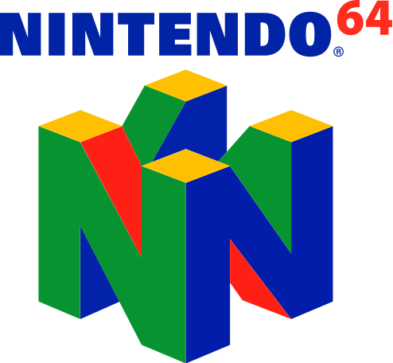
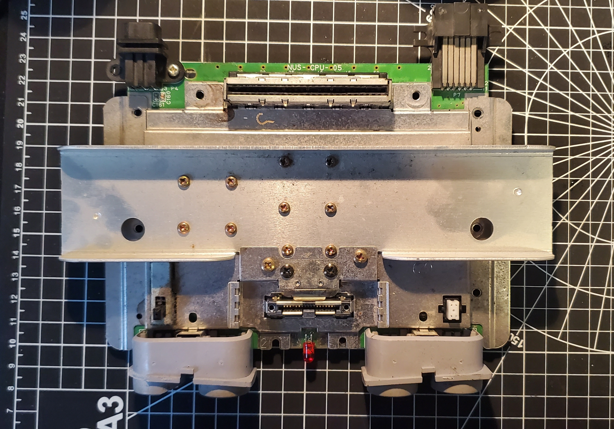
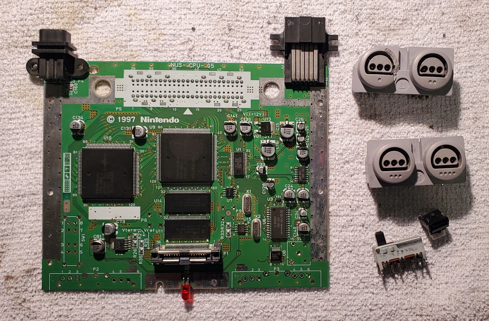
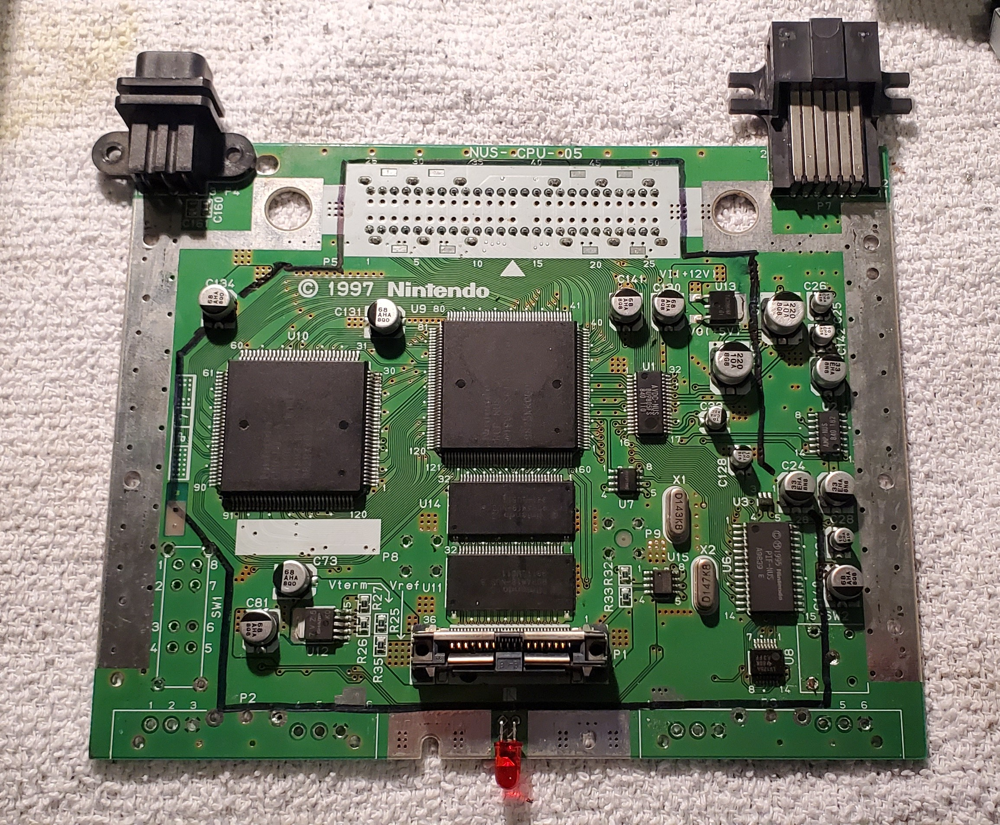
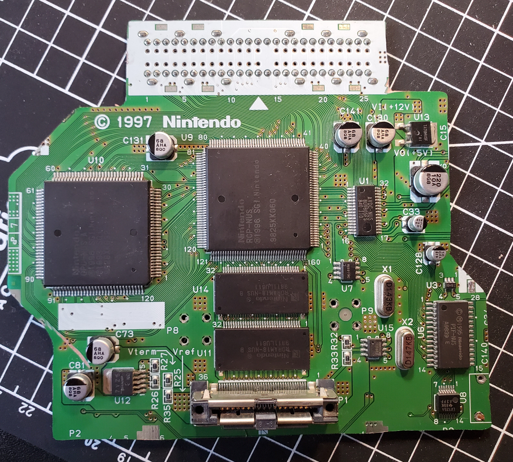

 
  

<h1 align="center"> Nintendo 64 Portable </h1>

<!-- TABLE OF CONTENTS -->
<h2 id="table-of-contents">Table of Contents</h2>

  
Table of Contents

  <ol>
    <li><a href="#about-the-project"> ➤ About The Project</a></li>
    <li><a href="#overview"> ➤ Overview</a></li>
    <li><a href="#n64-teardown"> ➤ Nintendo 64 Teardown</a></li>
    <li><a href="#pcb-design"> ➤ PCB Design</a></li>
  </ol>

<!-- ABOUT THE PROJECT -->
<h2 id="about-the-project">About The Project</h2>

 
  Growing up my favourite games were on the Nintendo 64, which makes sense because it was the first home console my family owned. My 6 year old mind was blown when my brother and I first booted up Super Mario 64 and saw Mario standing in front of us in the most cutting edge 3D graphics. My mind continued to get blown as the years went on and I played games like The Legend of Zelda: Ocarina of Time and Majora's Mask, Donkey Kong 64, Banjo-Kazooie and Banjo-Tooie, the list goes on... These games and this console helped shape who I am today and I have a lot to thank them for. 
  
  Fastforward a few decades and I stumbled across a website called [Bitbuilt](https://bitbuilt.net/forums/index.php) , a site dedicated to the hacking and portabilization of home video game consoles using various methods like cutting motherboards down in size, developing custom PCBs for power management and sound, and many other amazing things the talented members have come up with. I spent years lurking on the website in awe of what people could achieve, consistently coming back every few months to scour through the forums and see what advances people have made. 
  
  Finally 2020 arrives and my pandemic boredom was peaking until I decided to go check up on BitBuilt. While scrolling through posts I stumble across the post for the annual summer building contest and I immediately knew I had found the cure for my boredom. I decided right then and there that despite never attempting a portable and knowing full well I would most likely fail, it would be such a fun way to flex my CAD skills as well as pick up some new ones along the way. 

<!-- OVERVIEW -->
<h2 id="overview">Overview</h2>

 
  In this project my goal was to utilize my knowledge of CAD and specifically designing for FDM 3D printing to it's full potential and build an ergonomic, sleek, yet still retro looking portable Nintendo 64. Before starting my design, I set my constraints:
  
  * All parts must fit in my 3D printer's print volume of 200mm2
  * Use common metric machine screws and off the shelf components
  * I will reuse the original controller buttons and controller chip
  * I wanted to learn how to design my own custom PCBs for the controller, power management system and audio amplifier
  * The console should have a cartridge slot (as opposed to an integrated flash card with all of the games on a microSD card, such as the [Everdrive 64](https://krikzz.com/store/home/55-everdrive-64-x7.html)
  * It's gotta look cool
  * Stretch goal: if I have time, devise a way to make a dock in order to play the console on a TV and have 4 player support.
 
Once the design constraints were fleshed out, it was time to begin. 

<!-- Nintendo 64 Anatomy -->
<h2 id="n64-teardown">Nintendo 64 Teardown</h2>

 
The first thing to do was find a donor board, begin researching and then begin disecting it. Luckily there is a ton of documentation and guides on the Bitbuilt forums that I ws able to use, so I will not be going over every single thing that I have done but I encourage you the reader to go over to Bitbuilt and explore the forums and guides.
  
I was able to find some consoles on Facebook marketplace which all had damaged cases for around $20 each and I quickly picked up 2 of them because I anticipated at least killing one board (spoiler, I killed more than one).
 

Donor Motherboard

After desoldering the controller ports, reset switch and power switch I began to outline how I would need to trim down the board. Using the trimming guide from the Bitbuilt forums I was able to outline where I would need to make my cuts. Once trimmed, some voltage lines needed to be rerouted and I began working on a solution for relocating the game cartridge.

Bare motherboard and trim outline

 

Trimmed Motherboard and Rerouted Voltage Lines

*Note: In December of 2020 a new advanced trimming guide was released on the website which allows for an even further reduction, unfortunately I did not have this at my disposal when doing this project so perhaps in the future when I build version 2.0 this will make things a lot less complicated.*

<!-- PCB Design -->
<h2 id="pcb-design">PCB Design</h2>

  
Going into this project I knew basically nothing about PCB design and one of my goals was to learn, so I downloaded Autodesk EAGLE and began playing with the software. The first PCBs I began designing were for the controller buttons. To replicate the feel of the original controller buttons and based off recommendations from members of the Bitbuilt forum, I chose to use [soft tactile buttons](https://www.adafruit.com/product/3101) (or "squishy tacts") for the main controls, and repurpose the membrane for the D-Pad. I was able to find an appropriate library for the buttons in EAGLE which provided me with the footprint, symbol, and CAD model and I also developed my own library for the button pads. 
  

